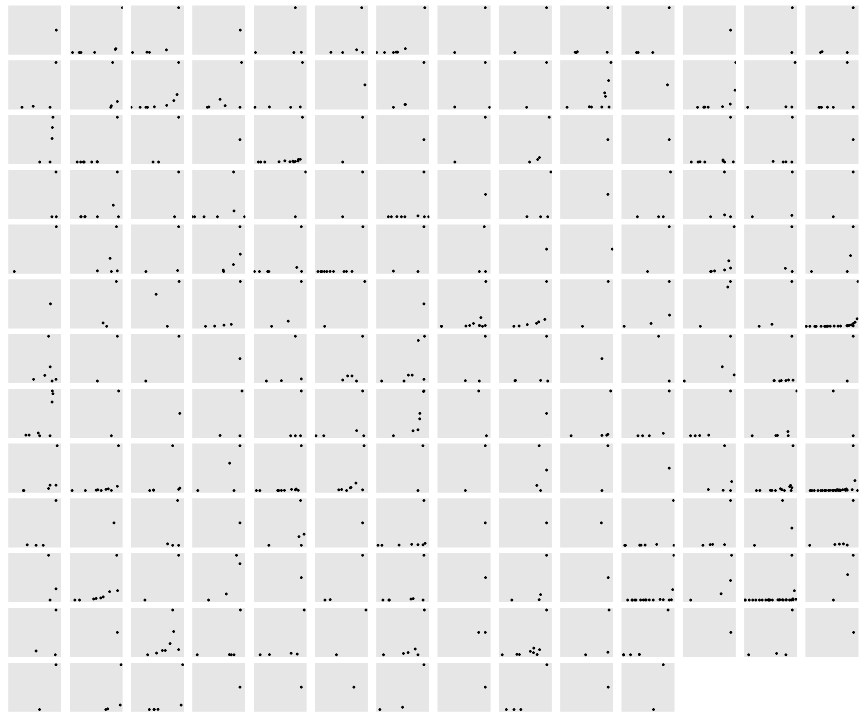

I just missed another chat on the rOpenSci website:

> I want to know the number of publications by people from a certain country, but I dont know how to achieve this...

Fun! Let's do that. It's a bit complicated because there is no field like geography of the authors. But there are affiliation fields, from which we can collect data we need.

## Installation

You'll need the GitHub version for the coutry names data, or just use the CRAN version, and get country names elsewhere. 


```r
install.packages("devtools")
devtools::install_github("rplos")
```


```r
library("rplos")
```

## Get the data


```r
articles <- searchplos(q='*:*', limit = 5,
    fl=c("id","author_affiliate"), 
    fq=list('article_type:"Research Article"', "doc_type:full"))
```

## Search for country names in affilitation field


```r
(countries <- lapply(articles$data$author_affiliate, function(x){
  out <- sapply(isocodes$name, function(z) grepl(z, x))
  isocodes$name[out]
}))
#> [[1]]
#> [1] "Netherlands"
#> 
#> [[2]]
#> [1] "China"
#> 
#> [[3]]
#> [1] "Canada"
#> 
#> [[4]]
#> [1] "United States"
#> 
#> [[5]]
#> [1] "Canada"
```

You can combine this data with the previously collected data:


```r
# Helper function
splitem <- function(x){
  if(length(x) == 0) { NA } else {
    if(length(x) > 1) paste0(x, collapse = ", ") else x
  }
}

articles$data$countries <- sapply(countries, splitem)
head(articles$data)
#>                             id
#> 1 10.1371/journal.pone.0004237
#> 2 10.1371/journal.pone.0006239
#> 3 10.1371/journal.pone.0034856
#> 4 10.1371/journal.pone.0023490
#> 5 10.1371/journal.pone.0023141
#>                                                                                                                                                                                                                                                                                                                                                                                                                                                                                                                          author_affiliate
#> 1                                                                                                                                        Division of General Internal Medicine, Department of Medicine, Radboud University Nijmegen Medical Center, Nijmegen, The Netherlands; Nijmegen Institute of Infection, Inflammation and Immunity (N4i), Nijmegen, The Netherlands; Department of Pharmacology and Toxicology, Nijmegen Center for Molecular Life Sciences, Radboud University Nijmegen Medical Center, Nijmegen, The Netherlands
#> 2                                                                                                                                                                                                                                                                                                                                                              State Key Laboratory of Cognitive Neuroscience and Learning, Beijing Normal University, Beijing, China; Graduate University of Chinese Academy of Sciences, Beijing, China
#> 3                                                                                                                                                                                                                                                                                                         Rotman Research Institute of Baycrest, Toronto, Ontario, Canada; Department of Psychology, University of Toronto, Toronto, Ontario, Canada; Dalla Lana School of Public Health, University of Toronto, Toronto, Ontario, Canada
#> 4 AstraZeneca R&D Boston, Waltham, Massachusetts, United States of America; Department of Biology, Rosenstiel Basic Medical Sciences Research Center, Brandeis University, Waltham, Massachusetts, United States of America; Laboratory of Molecular Carcinogenesis, National Institute of Environmental Health Sciences, National Institutes of Health, Research Triangle Park, North Carolina, United States of America; Molecular Cardiology Research Institute, Tufts Medical Center, Boston, Massachusetts, United States of America
#> 5                                                                                                                                                                                                                                                                                                                                                                                                                                                                  Department of Medicine, McMaster University, Hamilton, Ontario, Canada
#>       countries
#> 1   Netherlands
#> 2         China
#> 3        Canada
#> 4 United States
#> 5        Canada
```

## Bigger data set

Okay, cool, lets do it on a bigger data set:


```r
articles <- searchplos(q='*:*', limit = 200,
    fl=c("id","counter_total_all","author_affiliate"), 
    fq=list('article_type:"Research Article"', "doc_type:full"))
```

Get countries


```r
countries <- lapply(articles$data$author_affiliate, function(x){
  out <- sapply(isocodes$name, function(z) grepl(z, x))
  isocodes$name[out]
})
df <- articles$data
df$countries <- sapply(countries, splitem)
```

Plot data


```r
library("ggplot2")
df$n_countries <- sapply(countries, length)
ggplot(df, aes(n_countries, as.numeric(counter_total_all))) +
  geom_point() +
  labs(y="total page views") + 
  theme_grey(base_size = 16)
```

 

## Into rplos

We'll probably add a function like this into `rplos`, as a convenient way to get handle this use case.
